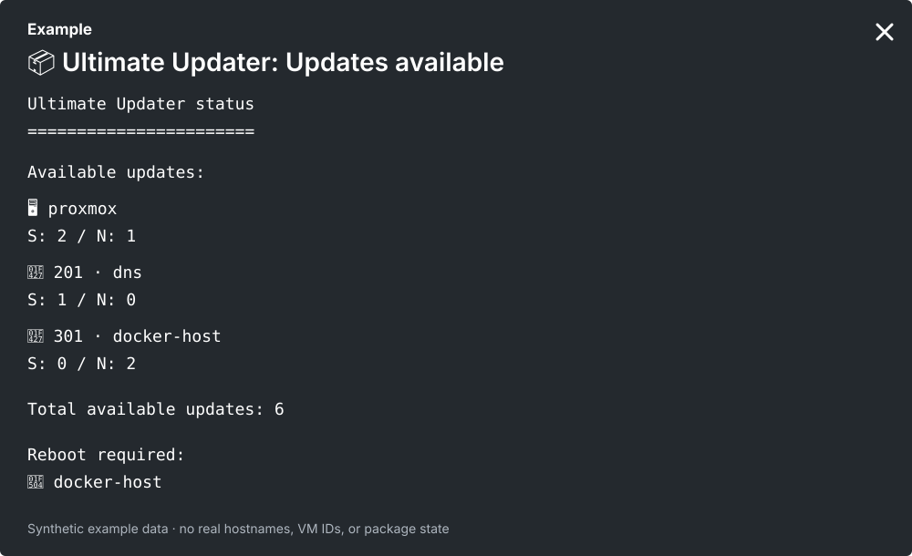

# Proxmox Ultimate Updater Notify

[](https://github.com/X1pheR/proxmox-ultimate-updater-notify/actions/workflows/ci.yml)
[](https://github.com/X1pheR/proxmox-ultimate-updater-notify/releases/latest)
[](LICENSE)

`proxmox-ultimate-updater-notify` is a community-maintained notification companion for [BassT23/Proxmox Ultimate Updater](https://github.com/BassT23/Proxmox). It adds safe scheduled update checks, deduplicated ntfy notifications, manual-run completion notifications, upstream compatibility health checks, and an optional Gatus dead-man heartbeat.

**It never installs package updates automatically and never changes guest power state during automatic checks.** Actual updates remain operator-triggered through Ultimate Updater.

This project is not affiliated with, endorsed by, or maintained by the Ultimate Updater project.

## What it adds

- Scheduled APT-only update checks at 07:00 and 19:00 through systemd.
- ntfy notifications when updates appear, change, clear, fail, or recover.
- Mobile-friendly Markdown update lists with security markers and reboot-required callouts.
- Notifications for completed operator-triggered Ultimate Updater runs.
- Compatibility checks that fail closed when the upstream integration boundary changes unexpectedly.
- Safe takeover and uninstall restoration of matching upstream automatic-check cron entries.
- Optional Gatus heartbeat delivery so a silent or disabled scheduled checker can be detected independently.
- Bounded command, HTTP, and service runtimes.

## Notification preview



*Privacy-safe synthetic example. Security updates are marked with a lock and reboot-required targets are called out explicitly.*

## Safety model

Automatic checks:

- refresh APT metadata and simulate upgrades only;
- never run `apt-get upgrade`, `dist-upgrade`, `full-upgrade`, or equivalent package-install commands;
- never start, stop, resume, suspend, or reboot LXC/VM guests;
- do not invoke the upstream `update -check` or `check-updates.sh` paths;
- fail instead of falling back to an unsupported or potentially mutating check path.

See [Safety and compatibility](docs/safety-and-compatibility.md) for the complete boundary, supported targets, compatibility guard, cron lifecycle, and runtime limits.

## Requirements

- Proxmox VE with Ultimate Updater installed under `/etc/ultimate-updater`;
- Bash, `curl`, GNU `timeout`, `sha256sum`, `python3`, `pct`, and `qm`;
- an ntfy topic and access token;
- key-based SSH for SSH-managed VMs, when used.

The current compatibility baseline targets Ultimate Updater 5.0 and Debian-family APT guests. See [Safety and compatibility](docs/safety-and-compatibility.md) for details.

## Quick start

```bash
git clone https://github.com/X1pheR/proxmox-ultimate-updater-notify.git
cd proxmox-ultimate-updater-notify
sudo bash install.sh
```

Configure ntfy in:

```text
/etc/proxmox-ultimate-updater-notify/config
```

Create the root-only token file:

```bash
sudo install -d -m 0750 /etc/proxmox-ultimate-updater-notify
sudo install -m 0600 /dev/null /etc/proxmox-ultimate-updater-notify/ntfy-token
sudoedit /etc/proxmox-ultimate-updater-notify/ntfy-token
```

Then verify the integration and run one non-installing check:

```bash
sudo /usr/local/libexec/proxmox-ultimate-updater-notify health
sudo /usr/local/libexec/proxmox-ultimate-updater-notify check
```

Continue to run Ultimate Updater manually as usual when you decide to install updates.

## Documentation

- [Configuration](docs/configuration.md) — ntfy, secret files, SSH-managed VMs, and optional Gatus heartbeat.
- [Safety and compatibility](docs/safety-and-compatibility.md) — automatic-check boundary, supported targets, compatibility health, cron ownership, and runtime limits.
- [Operations](docs/operations.md) — notification behavior, verification, systemd units, manual updates, and uninstall.

## Development

Run the behavior suite with:

```bash
bash tests/run.sh
```

CI also runs Bash syntax checks, ShellCheck, the behavior suite, and systemd unit verification.

## Security

No production credentials belong in this repository. Keep ntfy and Gatus tokens in root-readable token files, not in Git or command-line arguments.

Security-sensitive issues should be reported through GitHub Private Vulnerability Reporting for this repository. Use normal GitHub Issues only for non-sensitive bugs, questions, and discussions that do not contain credentials, tokens, private hostnames, exploit details, or other sensitive environment information.

## License and upstream relationship

This notifier is independently maintained and licensed under the MIT License. It does not redistribute or modify the Ultimate Updater source. Ultimate Updater is a separate upstream project with its own GNU GPL licensing and governance; consult the upstream repository for those terms.
